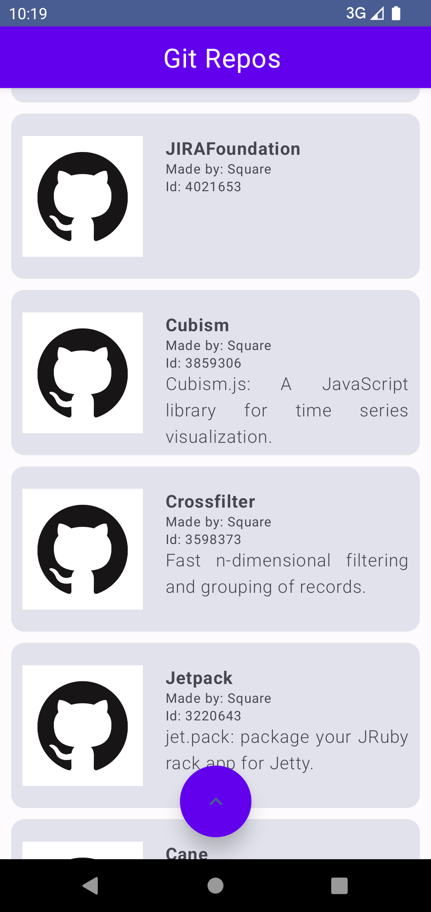

# GitHubApi
 GitHub API challenge created with provided API for square repositories.

 Project created in MVVM architecture in Compose, following the clean architecture.

 Created using Dependency Injection (Dagger/Hilt), Coroutines, Glide (Images added for better design).

 Tested using JUnit and mockk for mocking repository and coroutine response.

 Allows user to browse the list of square repositories, as well as open it (in browser) by clicking.

 
